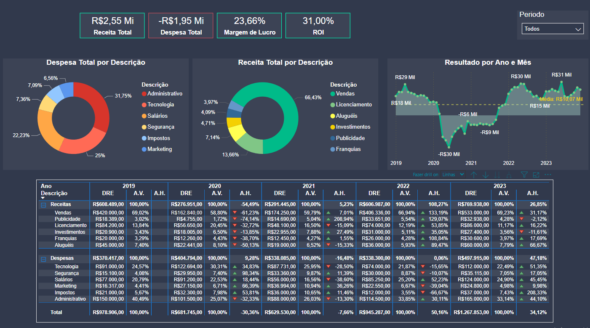

# 📊 Portfólio de Análise de Demonstração de Resultados (DRE)

## 📝 **Análise do Relatório**
- ✔️ Análise do resultado da empresa ao longo dos anos
- ✔️ Análise Vertical e horizontal
- ✔️ Verificação de indicadores de saúde financeira da empresa (Margem de Lucro, ROI)
- ✔️ Análise da composição da Receita e Despesa Total no decorrer do tempo.

